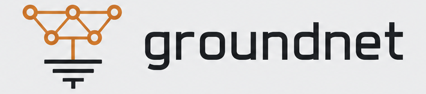

  <picture>
    <source media="(prefers-color-scheme: dark)" srcset="assets/logo-dark.png">
    
  </picture>

**A federation protocol for sharing *re-validated remediation wisdom* between sovereign
autonomous-operations instances.**

groundnet lets independent, self-governing operations agents exchange not raw telemetry and not
un-tested playbooks, but **distilled, outcome-verified remediation knowledge** — and it does so
without any of them ceding authority to a central party or to each other. Every shared unit is a
generalized *"this alert-class, diagnosed this way, resolved by this operation-class, and here is the
verified outcome"* — stripped of the sharer's estate, signed by a stable pseudonym, and recorded in a
public, tamper-evident transparency log. A consuming instance treats an imported unit as a **hint**,
never a command: it must re-earn trust locally, through that instance's own policy gate, before it is
allowed to influence anything.

This repository is the **protocol contract** — the stable envelope, the payload schema, the
attestation and transparency-log model, and the invariants a compliant node MUST uphold. It is *not*
the network, and it is *not* a node implementation.

> **Status: v0 — draft, contract-first.** The network itself is deliberately far-future. What is
> frozen here is the *shape* of the exchange (a stable envelope + a versioned payload + hard
> invariants) so that a node can be born groundnet-compatible instead of retrofitted. The payload
> body is explicitly versioned and expected to evolve.

## Why this exists

A single autonomous-operations instance learns only from its own incidents. A *network* of governed
instances, each contributing remediations that were **verified to actually work** and re-validated by
everyone who applied them, learns far faster than any one estate can alone — the way a security
community pools attack signals, but for *remediation* rather than detection.

The hard problem is doing this **safely**. Sharing operational knowledge between organizations is
normally a reconnaissance leak, a poisoning vector, and a trust-delegation risk all at once. groundnet
is the set of design decisions that make it safe:

- **Share the distillate, not the trace.** The estate-specific layer — hostnames, addresses,
  topology, credentials, raw incident traces — **never leaves the instance**. Only the generalizable
  layer (alert-class → diagnosis → resolution op-class → verified outcome, plus graduated artifacts
  with no estate identifier) is shareable.
- **Imported wisdom is subordinate, never authority.** A received unit is a hint to a node's own
  reasoning. It still passes that node's full local gate — access-list, never-auto floor, mode
  chokepoint, local verification — before it can earn any trust. The local policy is sovereign.
- **Reputation is earned by verified outcome, not by volume.** A contributor's weight is *"did your
  shared fix actually work when others applied it and their own verification confirmed it"* — never
  *"how much did you post."* This removes the perverse incentive to over-share sensitive data.
- **Attested, not identified.** Contributions are signed by a **stable pseudonym** (a keypair).
  Reputation accrues to the pseudonym; no real-world or estate identity ever leaves the instance.
- **Default-off, opt-in.** A node shares nothing until an operator explicitly turns federation on.

The nearest existing pattern is a security community's shared signal pool (a local engine + an opt-in,
anonymized community feed + reputation weighting). groundnet applies that proven shape to a new
domain — remediation — and adds the piece nobody else has: the shared unit is **re-validated against
each consumer's own verified outcomes** and re-graduated locally before it is trusted. We call that
*federated graduation*: trust is non-transferable and must be re-earned on every estate.

## The four locked decisions

These are settled and constrain everything in [`spec.md`](spec.md):

1. **Stable envelope, versioned payload.** The transport envelope (identity, signature, transparency
   proof, payload pointer) is stable and evolves slowly under strict compatibility rules. The payload
   *body* is versioned and free to evolve. A node is born envelope-compatible; the export adapter is
   the only part that gates on the frozen contract.
2. **Pseudonymous attestation — not identity.** The envelope carries a signature by a stable
   pseudonymous keypair. Reputation follows the pseudonym. No real-world or estate identity is ever
   transmitted, and the payload is de-identified. (A future unlinkable per-contribution mode trades
   reputation continuity for maximum privacy; the default is a stable pseudonym.)
3. **Signed transparency log — not a blockchain.** Provenance is a signed, append-only,
   tamper-evident transparency log with multiple independent witnesses (the Certificate-Transparency /
   Sigstore-Rekor model), **not** a blockchain. groundnet explicitly does *not* need global consensus
   on a single truth — subordinate-not-authority means every consumer re-validates locally, so there
   is no global state to agree on. A blockchain would add metadata leakage, latency, and token /
   smart-contract attack surface for no benefit.
4. **Subordinate-not-authority.** An ingested unit is a hint. It re-graduates through the consuming
   node's own governance before earning local trust. No node — including the original author — can
   make another node act.

## What groundnet is **not**

- **Not federated learning.** No gradients, weights, or model training cross the wire. groundnet
  exchanges *symbolic, human-auditable artifacts* — a generalized diagnosis and a resolution
  op-class with its verified outcome.
- **Not a public data dump.** Membership is authenticated; contributions are signed and attested;
  a truly-public tier exists only for units that carry zero estate-specific content.
- **Not a central authority or a registry of record.** There is no server that decides truth. The
  transparency log records *what was said and by which pseudonym* — not *what is true*.
- **Not a blockchain, token, or on-chain vote.** See locked decision 3.

## Relationship to nodes

groundnet is a protocol, not a product. Any governed-autonomy operations instance that can (a) produce
a de-identified, outcome-verified remediation unit and (b) re-graduate an imported unit through its own
local policy gate can speak it. [Territory Grounder](https://territorygrounder.com) is the reference
node, but the protocol is deliberately node-agnostic: this repository names no node internals.

## Built on open standards

groundnet composes existing, audited primitives rather than inventing crypto:

- **Sigstore / Rekor + Certificate Transparency** — the signed, multi-witness, append-only
  transparency-log model.
- **in-toto** — attestation format for the verified-outcome claims.
- **MISP-style** community sharing discipline — authenticated members, reputation, opt-in feeds.

## Governance

Sovereign peers, no central authority. Default-off, operator opt-in. Reputation by verified outcome.
The protocol is developed in the open; the contract in [`spec.md`](spec.md) changes only under the
compatibility rules stated there.

## Repository layout

| Path | What it is |
|------|-----------|
| [`README.md`](README.md) | This charter. |
| [`spec.md`](spec.md) | The protocol contract: envelope, payload, attestation, transparency log, invariants. |
| [`SECURITY.md`](SECURITY.md) | Coordinated disclosure for protocol-level security concerns. |
| [`LICENSE`](LICENSE) | Apache-2.0 (includes an explicit patent grant — important for an implementable protocol). |

## License

[Apache-2.0](LICENSE). The patent grant matters: groundnet is meant to be implemented freely by
anyone, including implementers who are not part of any single project.
